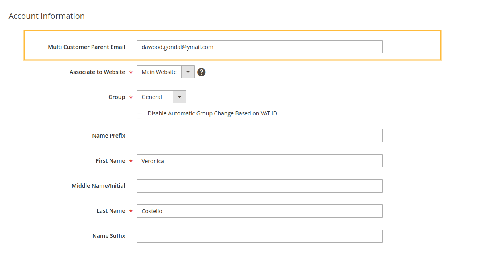
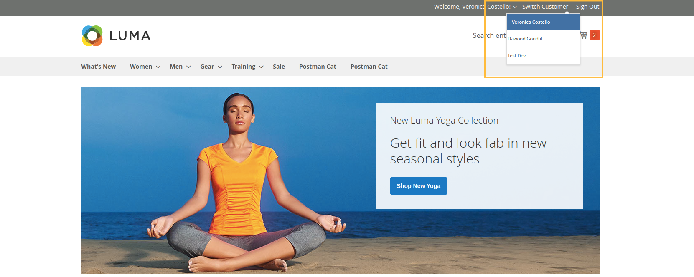

# M2Commerce: Magento 2 Multi Customer Management

## Description
This module helps you to give customer parental action and they can switch between each others accounts.
You can set the parental emails from admin under customers account and then you will see switcher dropdown in header section.

## Configuration




## Installation
### Magento® Marketplace

This extension will also be available on the Magento® Marketplace when approved.

1. Go to Magento® 2 root folder
2. Require/Download this extension:

   Enter following commands to install extension.

   ```
   composer require m2commerce/multi-customer-management"
   ```

   Wait while composer is updated.

   #### OR

   You can also download code from this repo under Magento® 2 following directory:

    ```
    app/code/M2Commerce/MultiCustomerManagement
    ```    

3. Enter following commands to enable the module:

   ```
   php bin/magento module:enable M2Commerce_MultiCustomerManagement
   php bin/magento setup:upgrade
   php bin/magento setup:di:compile
   php bin/magento cache:clean
   php bin/magento cache:flush
   ```

4. If Magento® is running in production mode, deploy static content:

   ```
   php bin/magento setup:static-content:deploy
   ```
